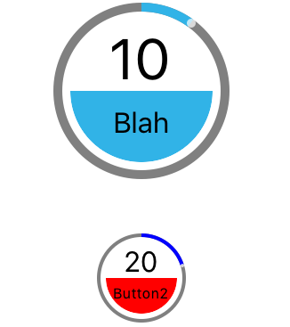

# TiCircularSliderBtn
A circular slider with button for Titanium
# TiCircularSlider [](http://www.appcelerator.com/titanium/)



## About
TiCircularSliderButton is a js module for Titanium for iOS and (soon to be Android). It uses
[TiCircularSlider](https://github.com/mpociot/TiCircularSlider).

TiCircularSlider uses the native modules
[EFCircularSlider](https://github.com/eliotfowler/EFCircularSlider) on iOS and [CircularSeekBar](https://github.com/RaghavSood/AndroidCircularSeekBar) on Android. 

## Quick Start

### Installation
Install the [TiCircularSlider](https://github.com/mpociot/TiCircularSlider) module.
Download the latest distribution ZIP-file and consult the [Titanium Documentation](http://docs.appcelerator.com/titanium/latest/#!/guide/Using_a_Module) on how install it, or simply use the [gitTio CLI](http://gitt.io/cli):

Download the TiCircularSliderBtn.js and put it in the app/lib directory.

Example can be found here [AlloySpikeExample] (https://github.com/kgividen/AlloySpike)

### Usage
```javascript
var args = arguments[0] || {};

var btn1 = require("/TiCircularSliderBtn").init({
	top:'20',
	name:'Blah',
	width: 100,
	height: 100,
	filledColor:'#31B3E7',
	unfilledColor: 'gray',
	btnOnColor: '#31B3E7'
});

var btn2 = require("/TiCircularSliderBtn").init({
	name: 'Button2',
	top:'150',
	width: 50,
	height: 50
});

btn1.onClick(function (e) {
	Ti.API.info("onClick btn1 E: " + JSON.stringify(e));
});

btn2.onClick(function (e) {
	Ti.API.info("onClick btn2 E: " + JSON.stringify(e));
});

btn1.onTouchEnd(function (e) {
	Ti.API.info("touchend E: " + JSON.stringify(e));
});

btn2.onTouchEnd(function (e) {
	Ti.API.info("touchend E: " + JSON.stringify(e));
});


$.win.addEventListener("open", function() {
    btn1.setBtnValue(10);
    btn2.setBtnValue(20);
});


$.win.add(btn1);
$.win.add(btn2);
```
